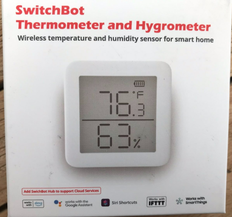

# SwitchBotMeter
Read SwitchBot Thermometer Hygrometer Indoor with Python without cloud or hub or app.
I use this for connect SwitchBot sensors to Domoticz / mosquitto via MQTT.

## Device

[Link to Amazon](https://www.amazon.de/gp/product/B08GYKLWVR)

[Link to Manufacturer](https://eu.switch-bot.com/pages/switchbot-meter)

## External projects

Uses [Bleak - Bluetooth Low Energy platform Agnostic Klient](https://github.com/hbldh/bleak)

[SwichBot BLE API](https://github.com/OpenWonderLabs/SwitchBotAPI-BLE)

Inspired by [sbm2web.py by Thomas Rudolph](https://cc2.tv/halde/sbm2web.pyskript)

## Preparation

 `pip install bleak`
 
`pip install paho-mqtt` (for SwitchBotMQTT.py only)

## Usage

start `SwitchBot.py` -> console output

start `SwitchBotMQTT.py` -> Domoticz (MQTT) connector

